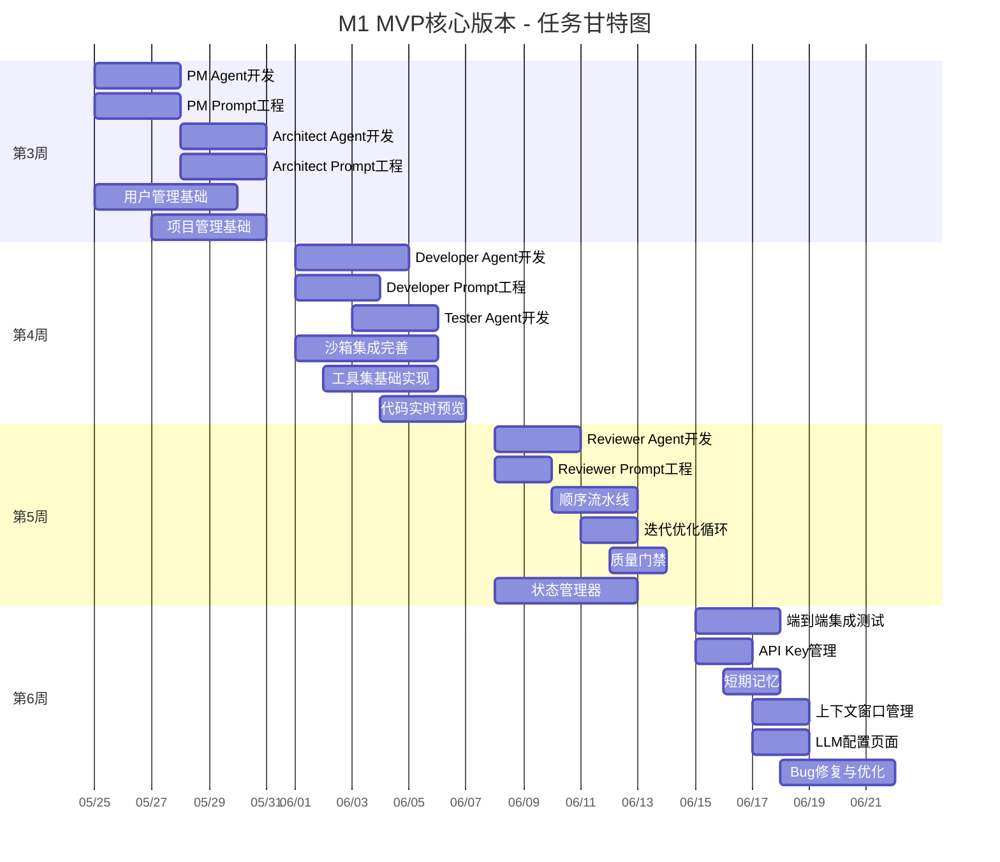
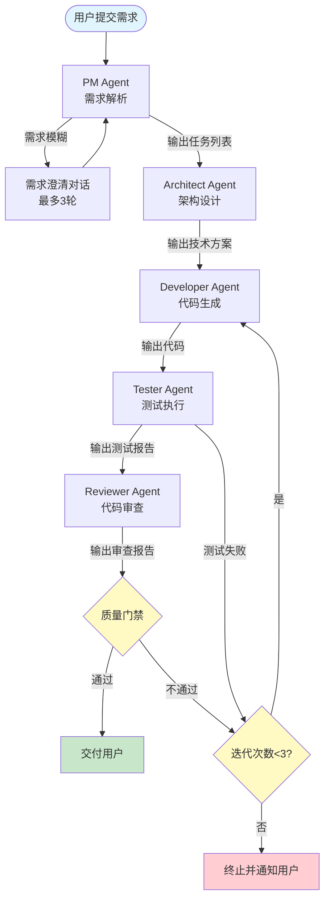
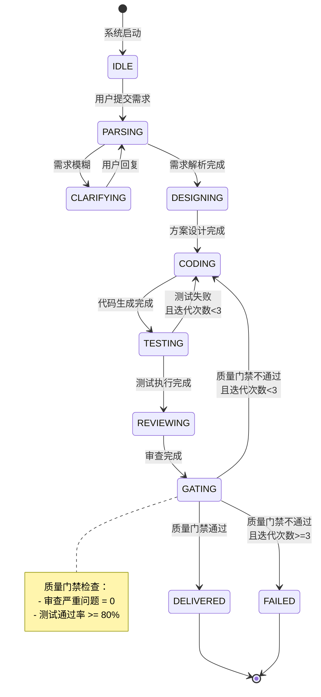

# DevCollab - M1 MVP核心版本 详细里程碑文档

> **版本**：v1.0
> **日期**：2026-05-11
> **作者**：AI应用开发团队
> **状态**：草稿
> **关联文档**：
> - [系统架构文档](../DevCollab-系统架构文档.md)
> - [功能清单文档](../DevCollab-功能清单文档.md)
> - [项目里程碑总览文档](./DevCollab-项目里程碑文档.md)

---

## 1. 里程碑概述

### 1.1 基本信息

| 属性 | 内容 |
|------|------|
| **里程碑编号** | M1 |
| **里程碑名称** | MVP核心版本 |
| **时间周期** | 第3-6周（2026年5月25日 - 2026年6月21日） |
| **持续时间** | 4周 |
| **核心目标** | 实现完整的端到端多Agent协作开发流程，用户输入需求后系统能自动输出代码+测试+审查报告 |
| **功能数量** | 36个P0功能 |
| **总工时估算** | 100人天 |
| **关键路径** | 5个Agent开发 + 工作流串联 |

### 1.2 里程碑在整体项目中的位置

```
M0 基础设施搭建 (第1-2周)
    ▼
▶ M1 MVP核心版本 (第3-6周) ◀ 当前里程碑
    ▼
M2 V1.1增强版本 (第7-10周)
    ▼
M3 V1.2高级版本 (第11-14周)
    ▼
M4 V2.0开源版本 (第15-18周)
```

### 1.3 M1阶段核心交付价值

M1是DevCollab项目的**第一个可演示版本**，核心目标是验证"多Agent协作开发"这一产品假设。本阶段完成后，用户应当能够：

1. 注册账号并创建项目
2. 用自然语言描述开发需求
3. 观看系统自动完成需求分析 → 架构设计 → 代码生成 → 测试执行 → 代码审查的完整流程
4. 获取可运行的代码、测试用例和审查报告
5. 在审查/测试不通过时，系统自动迭代修复（最多3轮）

---

## 2. 目标与范围

### 2.1 阶段目标

| 目标编号 | 目标描述 | 成功标准 |
|----------|----------|----------|
| G1 | 实现5个核心Agent的完整功能 | 每个Agent能独立完成职责范围内的任务 |
| G2 | 实现Agent协作工作流 | PM→Architect→Developer→Tester→Reviewer顺序执行，支持迭代循环 |
| G3 | 实现代码安全执行环境 | Docker沙箱能安全执行代码，隔离宿主机 |
| G4 | 实现用户认证和项目管理 | 用户可注册、登录、创建和管理项目 |
| G5 | 实现代码实时预览 | 前端能流式展示Agent生成的代码 |
| G6 | 通过端到端集成测试 | 核心流程无P0级Bug，系统可用性 >= 95% |

### 2.2 范围边界

**包含在M1范围内：**
- 5个核心Agent（PM/Architect/Developer/Tester/Reviewer）
- 顺序流水线 + 迭代优化循环 + 质量门禁
- Docker沙箱（创建/销毁/资源限制/超时/网络隔离/多语言环境）
- 基础工具集（代码执行/文件读写/终端命令/依赖安装）
- 用户注册/登录/JWT鉴权
- 项目创建/列表/详情
- 短期记忆 + 上下文窗口管理
- 代码实时预览（流式输出）
- LLM配置

**不包含在M1范围内（后续版本实现）：**
- 长期记忆、语义检索、项目知识库
- Git集成（克隆/分支/Commit/PR）
- 文档生成（README/API文档/架构文档）
- Agent状态面板、任务时间线、Token监控
- 并行执行、工作流暂停/恢复、人工干预
- 第三方登录、项目模板
- 代码重构、增量开发

### 2.3 M1功能覆盖清单

| 模块 | 功能编号 | 功能名称 | 优先级 |
|------|----------|----------|--------|
| **F01 用户管理** | F01-01 | 用户注册 | P0 |
| | F01-02 | 用户登录 | P0 |
| | F01-06 | API Key管理 | P0 |
| **F02 项目管理** | F02-01 | 创建项目 | P0 |
| | F02-02 | 项目列表 | P0 |
| | F02-03 | 项目详情 | P0 |
| **F03 Agent协作引擎** | F03-01-01 | 自然语言需求解析 | P0 |
| | F03-01-02 | 需求澄清对话 | P0 |
| | F03-01-03 | 任务拆解 | P0 |
| | F03-01-04 | 优先级排序 | P0 |
| | F03-01-05 | 验收标准生成 | P0 |
| | F03-02-01 | 技术方案设计 | P0 |
| | F03-02-03 | API接口设计 | P0 |
| | F03-02-04 | 数据模型设计 | P0 |
| | F03-03-01 | 代码生成 | P0 |
| | F03-03-02 | 多语言支持 | P0 |
| | F03-03-03 | 代码注释生成 | P0 |
| | F03-03-04 | 错误处理编写 | P0 |
| | F03-03-05 | Bug修复 | P0 |
| | F03-04-01 | 单元测试生成 | P0 |
| | F03-04-04 | 测试执行 | P0 |
| | F03-04-06 | 测试报告生成 | P0 |
| | F03-05-01 | 代码质量审查 | P0 |
| | F03-05-02 | 安全漏洞检测 | P0 |
| | F03-05-05 | 审查报告生成 | P0 |
| **F04 工作流管理** | F04-01 | 顺序流水线 | P0 |
| | F04-02 | 迭代优化循环 | P0 |
| | F04-07 | 质量门禁 | P0 |
| **F05 工具集** | F05-01 | 代码执行器 | P0 |
| | F05-02 | 文件读写工具 | P0 |
| | F05-03 | 终端命令工具 | P0 |
| | F05-09 | 依赖安装工具 | P0 |
| **F06 记忆与上下文** | F06-01 | 短期记忆 | P0 |
| | F06-03 | 上下文窗口管理 | P0 |
| **F07 代码沙箱** | F07-01 | 沙箱创建 | P0 |
| | F07-02 | 沙箱销毁 | P0 |
| | F07-03 | 资源限制 | P0 |
| | F07-04 | 执行超时 | P0 |
| | F07-05 | 网络隔离 | P0 |
| | F07-07 | 执行日志 | P0 |
| | F07-09 | 多语言环境 | P0 |
| **F10 可视化与监控** | F10-04 | 代码实时预览 | P0 |
| **F11 系统设置** | F11-01 | LLM配置 | P0 |

---

## 3. 任务分解

### 3.1 任务总览



### 3.2 第3周：PM Agent + Architect Agent + 用户/项目基础

**时间**：2026-05-25 至 2026-05-31
**主题**：需求分析与架构设计Agent + 用户认证与项目管理基础
**目标**：完成前两个Agent的开发，建立用户和项目的核心数据模型

#### 3.2.1 任务清单

| 编号 | 任务名称 | 描述 | 对应功能 | 负责人 | 预估工时 | 依赖 |
|------|----------|------|----------|--------|----------|------|
| M1-W3-01 | PM Agent开发 | 实现需求解析、任务拆解、优先级排序、验收标准生成 | F03-01-01~05 | AI工程师+后端 | 3天 | M0-W2-01, M0-W2-02 |
| M1-W3-02 | PM Prompt工程 | 设计PM Agent的系统提示词和输出格式模板 | F03-01 | AI工程师 | 3天 | M1-W3-01 |
| M1-W3-03 | Architect Agent开发 | 实现技术方案设计、API接口设计、数据模型设计 | F03-02-01~04 | AI工程师+后端 | 3天 | M0-W2-01, M0-W2-02 |
| M1-W3-04 | Architect Prompt工程 | 设计Architect Agent的系统提示词 | F03-02 | AI工程师 | 3天 | M1-W3-03 |
| M1-W3-05 | 用户管理基础 | 实现用户注册、登录、JWT鉴权 | F01-01~02 | 后端 | 5天 | M0-W1-02, M0-W1-04 |
| M1-W3-06 | 项目管理基础 | 实现创建项目、项目列表、项目详情 | F02-01~03 | 后端+前端 | 4天 | M1-W3-05 |

#### 3.2.2 技术要点

**PM Agent开发要点：**
- 继承BaseAgent，实现 `think` / `act` / `observe` 生命周期
- 输入：用户自然语言需求 + 项目技术栈约束
- 输出：JSON结构化任务列表（包含任务名称、描述、优先级、验收标准）
- 集成需求澄清对话机制（最多3轮澄清）
- 使用LangGraph节点实现需求解析工作流

**Architect Agent开发要点：**
- 输入：PM Agent输出的任务列表 + 项目技术栈
- 输出：Markdown技术方案文档 + API接口定义 + 数据模型设计
- 支持根据技术栈约束生成对应架构（如FastAPI+Vue、Spring+React等）
- 输出格式需标准化，便于Developer Agent解析

**用户管理基础要点：**
- 密码使用bcrypt加密存储
- JWT Token包含用户ID和过期时间
- 实现Token刷新机制
- 注册/登录接口返回标准错误码

**项目管理基础要点：**
- 项目表包含：id, name, description, tech_stack, owner_id, created_at, updated_at
- 技术栈使用JSON字段存储（如 `["Python", "FastAPI", "Vue 3"]`）
- 项目列表支持分页和基础筛选
- 项目详情页展示项目概览和关联任务列表

#### 3.2.3 交付物

- `backend/app/agents/pm_agent.py` - PM Agent完整实现
- `backend/app/agents/architect_agent.py` - Architect Agent完整实现
- `backend/app/prompts/pm_prompts.py` - PM Prompt模板
- `backend/app/prompts/architect_prompts.py` - Architect Prompt模板
- `backend/app/api/auth.py` - 用户认证接口
- `backend/app/api/projects.py` - 项目管理接口
- `frontend/src/views/Login.vue` - 登录/注册页面
- `frontend/src/views/ProjectList.vue` - 项目列表页面
- `frontend/src/views/ProjectDetail.vue` - 项目详情页面

---

### 3.3 第4周：Developer Agent + Tester Agent + 沙箱与工具集

**时间**：2026-06-01 至 2026-06-07
**主题**：代码开发与测试Agent + 沙箱安全环境 + 基础工具集
**目标**：完成后两个核心Agent，建立安全的代码执行环境

#### 3.3.1 任务清单

| 编号 | 任务名称 | 描述 | 对应功能 | 负责人 | 预估工时 | 依赖 |
|------|----------|------|----------|--------|----------|------|
| M1-W4-01 | Developer Agent开发 | 实现代码生成、多语言支持、注释生成、错误处理 | F03-03-01~04 | AI工程师+后端 | 4天 | M1-W3-03, M1-W3-04 |
| M1-W4-02 | Developer Prompt工程 | 设计Developer Agent的系统提示词和代码输出规范 | F03-03 | AI工程师 | 3天 | M1-W4-01 |
| M1-W4-03 | Tester Agent开发 | 实现单元测试生成、测试执行、测试报告生成 | F03-04-01,04,06 | AI工程师+后端 | 3天 | M1-W4-01 |
| M1-W4-04 | 沙箱集成完善 | 完善沙箱安全策略（资源限制、超时、网络隔离、多语言环境） | F07-01~09 | 后端 | 5天 | M0-W2-03 |
| M1-W4-05 | 工具集基础实现 | 实现代码执行器、文件读写、终端命令、依赖安装工具 | F05-01~03,09 | 后端 | 4天 | M1-W4-04 |
| M1-W4-06 | 代码实时预览 | 前端实现代码流式输出和语法高亮展示 | F10-04 | 前端 | 3天 | M0-W2-05 |

#### 3.3.2 技术要点

**Developer Agent开发要点：**
- 输入：Architect Agent的技术方案 + 具体任务描述
- 输出：完整代码文件（包含代码注释和错误处理）
- 支持多语言：Python、JavaScript/TypeScript、Java、Go
- 代码输出格式：使用代码块标记语言类型，便于前端解析
- 集成文件读写工具，将代码写入沙箱文件系统
- 支持根据技术栈自动选择语言（如FastAPI→Python，Spring→Java）

**Tester Agent开发要点：**
- 输入：Developer Agent生成的代码 + 验收标准
- 输出：单元测试代码 + 测试执行报告
- 支持多语言测试框架：pytest（Python）、jest（JS/TS）、JUnit（Java）
- 测试执行在沙箱中进行，收集通过/失败结果
- 生成结构化测试报告（通过率、失败详情）

**沙箱安全策略要点：**
- Docker容器资源限制：CPU 1核、内存 512MB、磁盘 1GB
- 执行超时：默认60秒，可配置
- 网络隔离：禁止访问外部网络（--network none）
- 只读挂载：仅挂载任务所需文件目录
- 自动销毁：任务完成后立即销毁容器
- 多语言环境：基础镜像包含Python 3.11、Node.js 18、OpenJDK 17、Go 1.22

**工具集实现要点：**
- 代码执行器：在沙箱中执行代码，返回stdout/stderr
- 文件读写：支持创建/读取/修改/删除文件
- 终端命令：在沙箱中执行Shell命令（白名单机制）
- 依赖安装：支持pip、npm、Maven等包管理器

**代码实时预览要点：**
- WebSocket接收流式代码输出
- 使用Monaco Editor或CodeMirror实现语法高亮
- 支持多种编程语言高亮
- 流式渲染，逐字符/逐行展示

#### 3.3.3 交付物

- `backend/app/agents/developer_agent.py` - Developer Agent完整实现
- `backend/app/agents/tester_agent.py` - Tester Agent完整实现
- `backend/app/prompts/developer_prompts.py` - Developer Prompt模板
- `backend/app/prompts/tester_prompts.py` - Tester Prompt模板
- `backend/sandbox/manager.py` - 沙箱管理器（生产级）
- `backend/sandbox/executor.py` - 代码执行器
- `backend/app/tools/code_executor.py` - 代码执行工具
- `backend/app/tools/file_manager.py` - 文件管理工具
- `backend/app/tools/terminal.py` - 终端工具
- `backend/app/tools/dependency.py` - 依赖安装工具
- `frontend/src/components/CodeViewer.vue` - 代码查看器组件
- `frontend/src/composables/useStream.ts` - 流式输出Hook

---

### 3.4 第5周：Reviewer Agent + 工作流串联

**时间**：2026-06-08 至 2026-06-14
**主题**：代码审查Agent + 工作流引擎 + 质量门禁
**目标**：完成最后一个核心Agent，实现Agent协作工作流

#### 3.4.1 任务清单

| 编号 | 任务名称 | 描述 | 对应功能 | 负责人 | 预估工时 | 依赖 |
|------|----------|------|----------|--------|----------|------|
| M1-W5-01 | Reviewer Agent开发 | 实现代码质量审查、安全漏洞检测、审查报告生成 | F03-05-01~02,05 | AI工程师+后端 | 3天 | M1-W4-01, M1-W4-03 |
| M1-W5-02 | Reviewer Prompt工程 | 设计Reviewer Agent的审查维度和报告格式 | F03-05 | AI工程师 | 2天 | M1-W5-01 |
| M1-W5-03 | 顺序流水线 | 实现PM→Architect→Developer→Tester→Reviewer顺序执行 | F04-01 | 后端 | 3天 | M1-W3-01, M1-W3-03, M1-W4-01, M1-W4-03, M1-W5-01 |
| M1-W5-04 | 迭代优化循环 | 实现审查/测试不通过时自动返回Developer修复（最多3轮） | F04-02 | 后端 | 2天 | M1-W5-03 |
| M1-W5-05 | 质量门禁 | 实现审查通过率/测试覆盖率不达标时阻止交付 | F04-07 | 后端 | 2天 | M1-W5-03 |
| M1-W5-06 | 状态管理器 | 实现全局任务状态管理和上下文传递 | - | 后端 | 5天 | M0-W2-02 |

#### 3.4.2 技术要点

**Reviewer Agent开发要点：**
- 输入：Developer Agent生成的代码 + Tester Agent的测试报告
- 输出：结构化审查报告（问题分级：严重/警告/建议）
- 审查维度：
  - 代码质量：命名规范、代码重复、圈复杂度
  - 安全漏洞：SQL注入、XSS、硬编码密钥
  - 代码风格：是否符合语言规范
- 集成静态分析工具（Ruff/pylint for Python, ESLint for JS）
- 报告格式：JSON，包含问题位置、严重程度、改进建议

**顺序流水线实现要点：**
- 使用LangGraph构建有向图工作流
- 节点：PM → Architect → Developer → Tester → Reviewer
- 边：顺序执行，前一个Agent完成触发下一个
- 状态传递：每个Agent的输出作为下一个Agent的输入
- 错误处理：任一Agent失败则工作流终止

**迭代优化循环实现要点：**
- 条件边：Reviewer/Tester输出决定流向
- 通过条件：审查无严重问题 + 测试全部通过
- 失败处理：返回Developer Agent修复，附带审查/测试反馈
- 最大迭代次数：3次（防止无限循环）
- Token预算：每次迭代消耗Token累计，超限则终止

**质量门禁实现要点：**
- 审查门禁：严重问题数 = 0，警告问题数 <= 3
- 测试门禁：测试通过率 >= 80%
- 不通过时：触发迭代循环或终止工作流
- 通过时：标记任务为完成，生成最终交付物

**状态管理器实现要点：**
- 维护全局任务状态（pending/running/done/failed）
- 存储每个Agent的输入/输出上下文
- 支持状态持久化到PostgreSQL
- 提供状态查询接口（供前端展示进度）
- 上下文传递：确保Agent间上下文不丢失

#### 3.4.3 交付物

- `backend/app/agents/reviewer_agent.py` - Reviewer Agent完整实现
- `backend/app/prompts/reviewer_prompts.py` - Reviewer Prompt模板
- `backend/app/core/orchestrator.py` - 工作流编排器
- `backend/app/core/state_manager.py` - 状态管理器
- `backend/app/core/quality_gate.py` - 质量门禁模块
- `backend/app/api/tasks.py` - 任务管理接口
- `backend/app/api/websocket.py` - WebSocket实时通信

---

### 3.5 第6周：集成测试 + 完善功能 + Bug修复

**时间**：2026-06-15 至 2026-06-21
**主题**：端到端集成测试 + 记忆模块 + 配置页面 + Bug修复
**目标**：确保核心流程稳定可用，完成MVP所有功能

#### 3.5.1 任务清单

| 编号 | 任务名称 | 描述 | 对应功能 | 负责人 | 预估工时 | 依赖 |
|------|----------|------|----------|--------|----------|------|
| M1-W6-01 | 端到端集成测试 | 编写完整的端到端测试用例，覆盖主流程 | - | 测试工程师+全员 | 3天 | M1-W5-03, M1-W5-04 |
| M1-W6-02 | API Key管理 | 实现用户LLM API Key的安全存储和调用 | F01-06 | 后端 | 2天 | M1-W3-05 |
| M1-W6-03 | 短期记忆 | 实现会话内对话历史和中间产物存储 | F06-01 | 后端 | 2天 | M0-W2-04 |
| M1-W6-04 | 上下文窗口管理 | 实现智能上下文裁剪和压缩 | F06-03 | AI工程师+后端 | 2天 | M1-W6-03 |
| M1-W6-05 | LLM配置页面 | 前端实现LLM模型选择和参数配置 | F11-01 | 前端 | 2天 | M1-W3-05 |
| M1-W6-06 | Bug修复与优化 | 修复集成测试发现的问题，优化响应速度 | - | 全员 | 4天 | M1-W6-01 |

#### 3.5.2 技术要点

**端到端集成测试要点：**
- 测试场景1：用户输入"实现用户登录功能" → 验证输出代码+测试+审查报告
- 测试场景2：输入模糊需求 → 验证PM Agent发起澄清对话
- 测试场景3：代码有Bug → 验证Tester检出并触发迭代修复
- 测试场景4：代码质量差 → 验证Reviewer检出并触发迭代修复
- 测试工具：pytest + httpx（API测试）+ Playwright（前端E2E）
- 性能测试：验证响应时间指标

**API Key管理要点：**
- 使用AES-256加密存储用户API Key
- 支持用户添加/删除/更新API Key
- 系统优先使用用户自有Key，否则使用系统默认Key
- API Key在内存中解密，不落盘明文

**短期记忆要点：**
- 存储当前会话的Agent对话历史
- 存储中间产物（任务列表、技术方案、代码、测试报告）
- 使用Redis存储，会话结束时持久化到PostgreSQL
- 支持按会话ID查询完整历史

**上下文窗口管理要点：**
- 监控Token使用量，接近限制时触发裁剪
- 裁剪策略：保留最近N轮对话 + 关键产物摘要
- 摘要机制：对长对话生成摘要替代原始内容
- 支持配置最大上下文Token数

**LLM配置页面要点：**
- 支持选择模型：GPT-4o / Claude-3.5-Sonnet
- 配置参数：温度(0-1)、最大Token数、Top-P
- 保存配置到用户偏好
- 实时验证API Key有效性

**Bug修复与优化要点：**
- 优先级：P0（阻塞流程）> P1（功能缺陷）> P2（体验问题）
- 性能优化：减少不必要的LLM调用、优化Prompt长度
- 前端优化：减少重渲染、优化WebSocket重连

#### 3.5.3 交付物

- `backend/tests/e2e/test_full_pipeline.py` - 端到端测试套件
- `backend/app/api/api_key.py` - API Key管理接口
- `backend/app/memory/short_term.py` - 短期记忆模块
- `backend/app/memory/context.py` - 上下文管理器
- `frontend/src/views/Settings.vue` - 系统设置页面
- `frontend/src/components/TokenCounter.vue` - Token消耗计数器
- Bug修复记录文档

---

## 4. 工作流详细设计

### 4.1 M1核心工作流



### 4.2 状态机设计



### 4.3 Agent间消息格式

```json
{
  "message_id": "msg_abc123",
  "session_id": "sess_xyz789",
  "task_id": "task_def456",
  "from_agent": "PM Agent",
  "to_agent": "Architect Agent",
  "msg_type": "task_assignment",
  "content": {
    "task_list": [
      {
        "id": "task_1",
        "title": "实现用户登录接口",
        "description": "...",
        "priority": 1,
        "acceptance_criteria": [...]
      }
    ],
    "project_context": {
      "tech_stack": ["Python", "FastAPI"],
      "constraints": [...]
    }
  },
  "metadata": {
    "tokens_used": 1500,
    "duration_ms": 3200,
    "timestamp": "2026-06-10T10:00:00Z"
  }
}
```

---

## 5. 验收标准

### 5.1 功能验收标准

| 编号 | 验收项 | 验收条件 | 对应KPI | 测试方法 |
|------|--------|----------|---------|----------|
| M1-AC-01 | 端到端流程 | 用户输入"实现用户登录功能" → 系统输出完整代码+测试+审查报告 | 任务完成率 >= 80% | E2E测试 |
| M1-AC-02 | 代码质量 | 生成的代码语法正确率 >= 90% | 代码可用率 >= 75% | 静态分析+沙箱执行 |
| M1-AC-03 | 测试能力 | 自动生成的测试覆盖核心业务逻辑路径 | 覆盖率 >= 70% | 覆盖率统计 |
| M1-AC-04 | 审查能力 | 能检出常见代码问题和安全漏洞 | 检出率 >= 80% | 注入已知问题测试 |
| M1-AC-05 | 迭代修复 | 审查/测试不通过时自动迭代修复（最多3轮） | - | 注入缺陷测试 |
| M1-AC-06 | 响应时间 | 需求解析 < 10s，单文件生成 < 30s，端到端 < 5min | - | 性能测试 |
| M1-AC-07 | 安全隔离 | 代码在沙箱中执行，无法访问宿主机资源 | - | 安全测试 |
| M1-AC-08 | 流式输出 | 代码生成过程实时展示 | - | 前端测试 |
| M1-AC-09 | 系统稳定 | 核心流程无P0级Bug | 系统可用性 >= 95% | 稳定性测试 |

### 5.2 性能验收标准

| 指标 | 目标值 | 测量方法 |
|------|--------|----------|
| 需求解析响应时间 | < 10秒 | 从提交到PM Agent输出任务列表 |
| 单文件代码生成时间 | < 30秒 | Developer Agent生成单个文件 |
| 端到端任务完成时间 | < 5分钟 | 从需求提交到最终交付 |
| 系统并发处理能力 | >= 5个并发任务 | 压力测试 |
| API响应时间(P95) | < 500ms | 非LLM调用接口 |
| 前端首屏加载时间 | < 3秒 | Lighthouse测试 |

### 5.3 安全验收标准

| 指标 | 目标值 | 测量方法 |
|------|--------|----------|
| 沙箱逃逸防护 | 0次成功逃逸 | 渗透测试 |
| 资源限制有效性 | CPU/内存/磁盘不超配 | 监控验证 |
| 网络隔离有效性 | 沙箱内无法访问外网 | 网络测试 |
| API Key加密存储 | AES-256加密 | 代码审计 |
| 用户认证安全 | JWT安全，无越权访问 | 安全测试 |

### 5.4 代码质量验收标准

| 指标 | 目标值 | 工具 |
|------|--------|------|
| 后端测试覆盖率 | >= 60% | pytest-cov |
| 前端测试覆盖率 | >= 50% | vitest coverage |
| 代码规范检查 | 100%通过 | Ruff + ESLint |
| 类型检查 | 100%通过 | mypy + vue-tsc |
| 圈复杂度 | <= 15 | radon |

---

## 6. 交付物清单

### 6.1 后端服务

```
backend/
├── app/
│   ├── agents/
│   │   ├── base.py                 # Agent基类
│   │   ├── pm_agent.py             # PM Agent
│   │   ├── architect_agent.py      # Architect Agent
│   │   ├── developer_agent.py      # Developer Agent
│   │   ├── tester_agent.py         # Tester Agent
│   │   └── reviewer_agent.py       # Reviewer Agent
│   ├── core/
│   │   ├── orchestrator.py         # 工作流编排器
│   │   ├── state_manager.py        # 状态管理器
│   │   ├── message_bus.py          # 消息总线
│   │   └── quality_gate.py         # 质量门禁
│   ├── tools/
│   │   ├── code_executor.py        # 代码执行器
│   │   ├── file_manager.py         # 文件管理
│   │   ├── terminal.py             # 终端工具
│   │   └── dependency.py           # 依赖安装
│   ├── memory/
│   │   ├── short_term.py           # 短期记忆
│   │   └── context.py              # 上下文管理
│   ├── prompts/
│   │   ├── pm_prompts.py           # PM Prompt模板
│   │   ├── architect_prompts.py    # Architect Prompt模板
│   │   ├── developer_prompts.py    # Developer Prompt模板
│   │   ├── tester_prompts.py       # Tester Prompt模板
│   │   └── reviewer_prompts.py     # Reviewer Prompt模板
│   ├── api/
│   │   ├── auth.py                 # 用户认证接口
│   │   ├── projects.py             # 项目管理接口
│   │   ├── tasks.py                # 任务管理接口
│   │   ├── api_key.py              # API Key管理接口
│   │   ├── chat.py                 # Agent对话接口
│   │   └── websocket.py            # WebSocket接口
│   └── models/
│       ├── user.py                 # 用户模型
│       ├── project.py              # 项目模型
│       ├── task.py                 # 任务模型
│       └── message.py              # 消息模型
├── tests/
│   ├── unit/                       # 单元测试
│   ├── integration/                # 集成测试
│   └── e2e/
│       └── test_full_pipeline.py   # 端到端测试
└── sandbox/
    ├── manager.py                  # 沙箱管理器
    ├── executor.py                 # 代码执行器
    └── Dockerfile                  # 沙箱镜像
```

### 6.2 前端应用

```
frontend/
├── src/
│   ├── views/
│   │   ├── Login.vue               # 登录/注册页
│   │   ├── ProjectList.vue         # 项目列表页
│   │   ├── ProjectDetail.vue       # 项目详情页
│   │   ├── ChatWorkspace.vue       # 对话工作台
│   │   └── Settings.vue            # 系统设置页
│   ├── components/
│   │   ├── AgentPanel.vue          # Agent状态面板
│   │   ├── CodeViewer.vue          # 代码查看器（语法高亮）
│   │   ├── ChatBubble.vue          # 对话气泡组件
│   │   ├── MarkdownRender.vue      # Markdown渲染组件
│   │   └── TokenCounter.vue        # Token消耗计数器
│   ├── composables/
│   │   ├── useWebSocket.ts         # WebSocket Hook
│   │   ├── useAgent.ts             # Agent交互Hook
│   │   └── useStream.ts            # 流式输出Hook
│   ├── stores/
│   │   ├── project.ts              # 项目状态
│   │   ├── chat.ts                 # 对话状态
│   │   └── agent.ts                # Agent状态
│   └── api/
│       ├── request.ts              # Axios实例
│       ├── project.ts              # 项目API
│       ├── task.ts                 # 任务API
│       └── websocket.ts            # WebSocket连接
```

### 6.3 基础设施

```
├── docker-compose.yml              # Docker Compose部署配置
├── backend/Dockerfile              # 后端Dockerfile
├── frontend/Dockerfile             # 前端Dockerfile
├── sandbox/Dockerfile              # 沙箱Dockerfile
├── nginx.conf                      # Nginx反向代理配置
└── scripts/
    ├── init_db.sql                 # PostgreSQL初始化脚本
    └── setup.sh                    # 一键部署脚本
```

### 6.4 文档

```
docs/
├── api/
│   └── openapi.json                # OpenAPI接口文档
├── deployment/
│   └── deployment_guide.md         # 部署指南
└── testing/
    └── test_report_m1.md           # M1测试报告
```

---

## 7. 风险与应对

### 7.1 风险矩阵

| 风险 | 概率 | 影响 | 风险等级 | 缓解措施 | 责任人 |
|------|------|------|----------|----------|--------|
| LLM生成代码质量不稳定 | 高 | 高 | 🔴 极高 | Reviewer Agent + 自动测试双重保障；Prompt多轮优化 | AI工程师 |
| Agent间上下文传递丢失 | 中 | 高 | 🟠 高 | 完善状态管理器；增加上下文校验机制；关键信息冗余传递 | 后端工程师 |
| 端到端流程延迟过长 | 中 | 中 | 🟡 中 | 优化Prompt减少Token；减少不必要的Agent调用；流式输出降低感知延迟 | AI工程师+后端 |
| 沙箱安全性不足 | 低 | 高 | 🟡 中 | Docker隔离 + 资源限制 + 超时机制；定期安全审计 | 后端工程师 |
| Prompt工程效果不达预期 | 中 | 高 | 🟠 高 | 预留Prompt调优时间；准备多套Prompt模板；A/B测试 | AI工程师 |
| 前端流式输出性能问题 | 中 | 低 | 🟢 低 | 使用虚拟列表；控制渲染频率；WebWorker处理解析 | 前端工程师 |
| LLM API服务不可用 | 低 | 高 | 🟡 中 | 准备备选模型；实现降级策略；本地缓存关键响应 | 后端工程师 |
| 团队成员请假/变动 | 中 | 中 | 🟡 中 | 关键任务双人backup；文档完善；代码Review机制 | 项目经理 |

### 7.2 风险应对预案

**预案1：LLM生成代码质量不达标**
- 触发条件：连续3次迭代后代码仍无法通过测试
- 应对措施：
  1. 降级使用更强大的模型（GPT-4o → GPT-4o-mini不行，应反向升级）
  2. 增加人工干预节点，让用户补充信息
  3. 缩小任务范围，将大任务拆分为更小的子任务
  4. 记录失败案例，用于后续Prompt优化

**预案2：Agent间上下文传递丢失**
- 触发条件：Developer Agent无法理解Architect Agent的技术方案
- 应对措施：
  1. 增加上下文校验层，检查关键字段完整性
  2. 关键信息冗余传递（如技术栈、约束条件在每个消息中重复）
  3. 增加上下文转换层，统一不同Agent的输出/输入格式
  4. 在状态管理器中保存完整上下文快照，支持回查

**预案3：端到端流程延迟过长**
- 触发条件：单次任务执行时间超过10分钟
- 应对措施：
  1. 优化Prompt长度，减少不必要的上下文
  2. 合并部分Agent调用（如Architect和PM可合并部分步骤）
  3. 增加流式输出，降低用户感知等待时间
  4. 实现异步任务队列，用户可后台等待

**预案4：沙箱安全漏洞**
- 触发条件：沙箱内代码成功访问宿主机资源
- 应对措施：
  1. 立即升级Docker版本，修复已知漏洞
  2. 增加seccomp安全配置文件
  3. 使用非root用户运行容器
  4. 增加安全审计日志，记录所有可疑操作

---

## 8. 依赖关系

### 8.1 内部依赖

```mermaid
flowchart LR
    subgraph M0[\"M0 基础设施\"]
        M0_1[Agent基类]
        M0_2[LangGraph集成]
        M0_3[沙箱原型]
        M0_4[消息总线]
        M0_5[前后端框架]
    end

    subgraph W3[\"第3周\"]
        W3_1[PM Agent]
        W3_2[Architect Agent]
        W3_3[用户管理]
        W3_4[项目管理]
    end

    subgraph W4[\"第4周\"]
        W4_1[Developer Agent]
        W4_2[Tester Agent]
        W4_3[沙箱完善]
        W4_4[工具集]
        W4_5[代码预览]
    end

    subgraph W5[\"第5周\"]
        W5_1[Reviewer Agent]
        W5_2[顺序流水线]
        W5_3[迭代循环]
        W5_4[质量门禁]
        W5_5[状态管理器]
    end

    subgraph W6[\"第6周\"]
        W6_1[集成测试]
        W6_2[API Key]
        W6_3[短期记忆]
        W6_4[上下文管理]
        W6_5[LLM配置页]
        W6_6[Bug修复]
    end

    M0_1 --> W3_1
    M0_1 --> W3_2
    M0_2 --> W3_1
    M0_2 --> W3_2
    M0_5 --> W3_3
    M0_5 --> W3_4

    W3_1 --> W4_1
    W3_2 --> W4_1
    W3_2 --> W4_2
    M0_3 --> W4_3
    W4_3 --> W4_4
    M0_5 --> W4_5

    W4_1 --> W5_1
    W4_2 --> W5_1
    W3_1 --> W5_2
    W3_2 --> W5_2
    W4_1 --> W5_2
    W4_2 --> W5_2
    W5_1 --> W5_2
    W5_2 --> W5_3
    W5_2 --> W5_4
    M0_2 --> W5_5

    W5_2 --> W6_1
    W5_3 --> W6_1
    W3_3 --> W6_2
    M0_4 --> W6_3
    W6_3 --> W6_4
    M0_5 --> W6_5
    W6_1 --> W6_6
```

### 8.2 外部依赖

| 依赖项 | 用途 | 获取方式 | 风险 |
|--------|------|----------|------|
| OpenAI API Key | LLM调用 | 官方申请 | 服务不可用、价格变动 |
| Claude API Key | LLM备选 | 官方申请 | 服务不可用 |
| Docker Engine | 沙箱环境 | 本地安装 | 版本兼容性 |
| PostgreSQL | 关系数据库 | Docker镜像 | 无 |
| Redis | 缓存/消息队列 | Docker镜像 | 无 |
| Node.js 18+ | 前端构建 | 本地安装 | 无 |
| Python 3.11+ | 后端运行 | 本地安装 | 无 |

---

## 9. 资源需求

### 9.1 人力资源

| 角色 | 人数 | 第3周 | 第4周 | 第5周 | 第6周 | 总工时 |
|------|------|-------|-------|-------|-------|--------|
| 后端工程师 | 2人 | 80h | 80h | 80h | 80h | 320h |
| 前端工程师 | 1人 | 32h | 40h | 16h | 32h | 120h |
| AI工程师 | 1人 | 48h | 56h | 40h | 32h | 176h |
| 测试工程师 | 0.5人 | 0h | 0h | 0h | 60h | 60h |
| **合计** | **4.5人** | **160h** | **176h** | **136h** | **204h** | **676h** |

### 9.2 计算资源

| 资源 | 配置 | 用途 | 成本估算 |
|------|------|------|----------|
| 开发服务器 | 8核16G | 日常开发 | 已有 |
| 测试服务器 | 4核8G | 集成测试 | ¥500/月 |
| LLM API调用 | - | Agent推理 | ¥2,000-5,000/月 |
| Docker Hub | - | 镜像存储 | 免费 |

### 9.3 外部服务

| 服务 | 用途 | 预估成本 |
|------|------|----------|
| OpenAI GPT-4o | 核心推理 | ¥1,500-3,000/月 |
| Claude 3.5 Sonnet | 备选模型 | ¥500-2,000/月 |
| 云服务器 | 部署环境 | ¥1,000/月 |

---

## 10. 沟通计划

### 10.1 会议安排

| 会议 | 频率 | 参与人 | 内容 |
|------|------|--------|------|
| 每日站会 | 每天 9:30 | 全员 | 昨日进展、今日计划、阻塞问题 |
| 周会 | 每周五 16:00 | 全员 | 周进度回顾、风险更新、下周计划 |
| 技术评审 | 按需 | 技术相关 | 架构设计、技术方案评审 |
| Demo演示 | 每周末 | 全员+PM | 功能演示、反馈收集 |

### 10.2 汇报机制

- **每日**：在项目管理工具（如Notion/Jira）更新任务状态
- **每周**：发送周报给项目干系人
- **里程碑结束**：提交里程碑总结报告

---

## 11. 变更管理

### 11.1 变更流程

```
变更申请 → 影响评估 → 审批决策 → 实施变更 → 验证变更 → 更新文档
```

### 11.2 变更审批权限

| 变更类型 | 审批人 | 说明 |
|----------|--------|------|
| 需求变更 | 产品经理+技术负责人 | 需评估对进度的影响 |
| 技术方案变更 | 技术负责人 | 需评估对架构的影响 |
| 排期变更 | 项目经理 | 需说明原因和调整方案 |
| Bug修复优先级 | 测试负责人 | P0级Bug可中断当前任务 |

---

## 12. 检查点与评审

### 12.1 每周检查点

| 检查项 | 检查内容 | 检查人 |
|--------|----------|--------|
| 任务完成率 | 本周计划任务完成比例 | 项目经理 |
| 代码质量 | 新增代码测试覆盖率、Lint通过率 | 后端工程师 |
| 阻塞问题 | 是否有未解决的阻塞问题 | 全员 |
| 风险状态 | 风险状态是否有变化 | 项目经理 |
| Token消耗 | 本周LLM API调用成本 | AI工程师 |

### 12.2 里程碑评审

| 评审项 | 评审内容 | 评审人 |
|--------|----------|--------|
| 功能完整性 | 所有P0功能是否实现 | 产品经理 |
| 验收标准 | 所有验收标准是否通过 | 测试工程师 |
| 代码质量 | 测试覆盖率、规范检查 | 技术负责人 |
| 性能指标 | 响应时间、并发能力 | 后端工程师 |
| 安全合规 | 沙箱安全、数据加密 | 安全负责人 |
| 文档完整性 | API文档、部署指南 | 技术负责人 |

### 12.3 退出标准

M1里程碑正式完成的条件：

1. ✅ 所有P0功能开发完成
2. ✅ 所有验收标准通过（M1-AC-01 ~ M1-AC-09）
3. ✅ 端到端测试通过率 >= 80%
4. ✅ 代码规范检查100%通过
5. ✅ 无P0级未修复Bug
6. ✅ 所有交付物已归档
7. ✅ 里程碑评审会议通过

---

## 13. 附录

### 13.1 术语表

| 术语 | 说明 |
|------|------|
| Agent | 智能代理，模拟软件团队中的特定角色 |
| Prompt | 提示词，指导LLM生成特定输出的文本 |
| 沙箱 | 隔离的执行环境，用于安全运行代码 |
| 质量门禁 | 代码交付前的质量检查关卡 |
| 迭代循环 | 审查/测试不通过时返回修复的循环机制 |
| Token | LLM处理文本的基本单位 |
| LangGraph | Agent工作流编排框架 |

### 13.2 参考文档

- [DevCollab-系统架构文档](../DevCollab-系统架构文档.md)
- [DevCollab-功能清单文档](../DevCollab-功能清单文档.md)
- [DevCollab-项目里程碑文档](./DevCollab-项目里程碑文档.md)
- [LangGraph官方文档](https://langchain-ai.github.io/langgraph/)
- [FastAPI官方文档](https://fastapi.tiangolo.com/)
- [Vue 3官方文档](https://vuejs.org/)

### 13.3 变更记录

| 版本 | 日期 | 变更内容 | 作者 |
|------|------|----------|------|
| v1.0 | 2026-05-11 | 初始版本，基于系统架构文档和功能清单文档创建 | AI应用开发团队 |

---

> **文档结束**
>
> 如有疑问或建议，请联系项目团队。